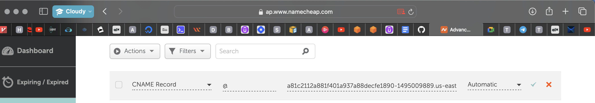
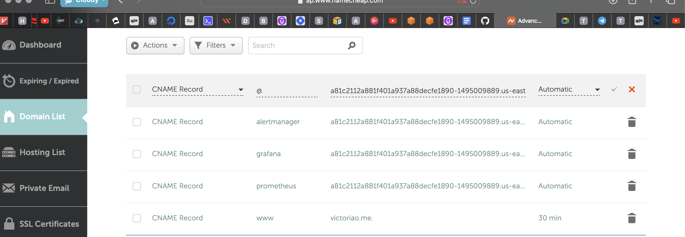

## Deploy the Socks Shop Microservices Application using Infrastructure as Code

### Introduction
This project is about deploying a microservices-based application Socks Shop, using automated tools to ensure quick, reliable, and secure deployment on Kubernetes. By focusing on Infrastructure as Code, you'll create a reproducible and maintainable deployment process that leverages modern DevOps practices and tools.

### Prerequisites

#### GitHub Account: 
Needed to access the Socks Shop repository

#### IaC Tool: Terraform
To automate cloud resource provisioning.

#### Cloud Provider Account: AWS
AWS to host Kubernetes cluster

#### Kubernetes Cluster: 
Necessary to automate deployment, scaling and operation

#### Kubectl
Kubernetes command-line tool, necessary for interacting with the cluster.

#### Let's Encrypt Account: 
Needed to secure the application with HTTPS

#### GitHub Actions: 
Needed to set up a deployment pipeline to build and deploy the application to the Kubernetes cluster

#### Helm: 
Package manager for Kubernetes that provides an easy way to find, share, and use software built for Kubernetes

#### Prometheus: 
Open-source monitoring and alerting toolkit designed for reliability and scalability. It collects metrics from configured targets at given intervals, evaluates rule expressions, displays results, and can trigger alerts if some condition is observed to be true.

### Deployment Pipeline 
- application source code is stored in the provided GitHub repository
- provision infrastructure using Terraform
- deploy the Socks Shop microservices to the Kubernetes cluster.
- setup Prometheus to monitor application health and Grafana to log activity.
- use Let's Encrypt to obtain SSL/TLS certificates and implement network security measures.

### Infrastructure Provisioning:
Socks Shop Resources: [GitHub Repo](https://github.com/microservices-demo/microservices-demo.github.io)

Demo: [Socks Shop Demo](https://github.com/microservices-demo/microservices-demo/tree/master)

Terraform: [Download](https://developer.hashicorp.com/terraform/install) Use Terraform to provision the necessary infrastructure resources on AWS, including VPCs, subnets, security groups, and EKS cluster. This allows for a clear and reproducible infrastructure setup.

1. Ensure AWS CLI is installed
- AWS CLI: [Installation Guide](https://aws.amazon.com/cli/)

2. Run `mkdir sockshop-project` to set up my sock-shop folder
3. Run `cd sockshop-project` and then `terraform init` to initialize terraform, `terraform plan` to create an execution plan then `terraform apply` to apply the configuration to set up my EKS cluster on AWS, the configuration can be found in my `sockshop.tf` file.
 
4. After running the terraform file, my EKS is created
5. Create a kubernetes folder in my sockshop-project. `mkdir kubern8s` then `cd kubern8s` and inside the kubern8s folder, clone the `deploy.yml` file from the github repo @ `eks-deploy.yml` and also create an ingress file with `touch eks-ingress.yml` and add contents of the `ingress.yml` file from the repo.  
6. To begin deployment, configure the kubectl to connect to the EKS cluster, the specified region and the cluster name. `aws eks update-kubeconfig --name sockshop --region us-east-1`

7. Deploy clusters by running `kubectl apply -f eks-deploy.yml ` 

8. Helm: [Helm Installation Guide](https://helm.sh/docs/intro/install/)
Add a Helm chart repository to Helm client. Helm is a package manager for Kubernetes that allows you to define, install, and upgrade complex Kubernetes applications. `helm repo add ingress-nginx https://kubernetes.github.io/ingress-nginx`

Assign `ingress-nginx` to the repository in local Helm configuration, can be referenced when installing charts from this repo

`https://kubernetes.github.io/ingress-nginx`: is the Helm chart repository URL that hosts the ingress-nginx charts. The ingress-nginx repository contains Helm charts for deploying NGINX as an Ingress controller in a Kubernetes cluster.

9. Install the `ingress-nginx Ingress` controller in a Kubernetes cluster using Helm with `helm install nginx ingress-nginx/ingress-nginx --namespace sock-shop`

10. Change the default namespace for the current Kubernetes context, run  `kubectl config set-context --current --namespace=sock-shop`

11. Retrieve information about the pods and services in the current Kubernetes namespace with `kubectl get pods,svc`

12. Set the CName record of domain `victoriao.me` to point to the load balancer address.

14. Add the Jetstack Helm chart repository to your local Helm environment to gain access to all the Helm charts hosted by Jetstack, including the Cert-Manager chart, which is widely used for managing certificates in Kubernetes. Run `helm repo add jetstack https://charts.jetstack.io --force-update`  

15. Install the Cert-Manager application into Kubernetes cluster
 
16. Run `touch certificates.yml` to create certificate file to securely access application

17. Run `kubectl apply -f certificates.yml` to apply the certificate configuration. Application should be accessible over https as shown below afterwards. 

18. Add the Prometheus Helm chart repository to our local Helm environment with `helm repo add prometheus https://prometheus-community.github.io/helm-charts`

19. Install the Kube-Prometheus-Stack Helm chart into a Kubernetes cluster with `helm install prometheus prometheus/kube-prometheus-stack -n sock-shop`

20. Go to DNS management and configure domain name to serve the several values of the grafana, prometheus and alertmanager as shown below.

21. Run `kubectl apply -f eks-ingress.yml` to apply the new configurations made for grafana, prometheus and alertmanager

### Conclusion
By automating the deployment process for the Socks Shop microservices application using Infrastructure as Code techniques, we've created a reliable, consistent, and maintainable setup. The deployment pipeline, monitoring and logging, and security measures we've implemented will ensure the application is deployed quickly, its health is monitored, and its operations can be traced and analyzed.

This approach sets the stage for future development and scaling of the Socks Shop application, as the automated deployment process can be easily replicated and updated as needed.